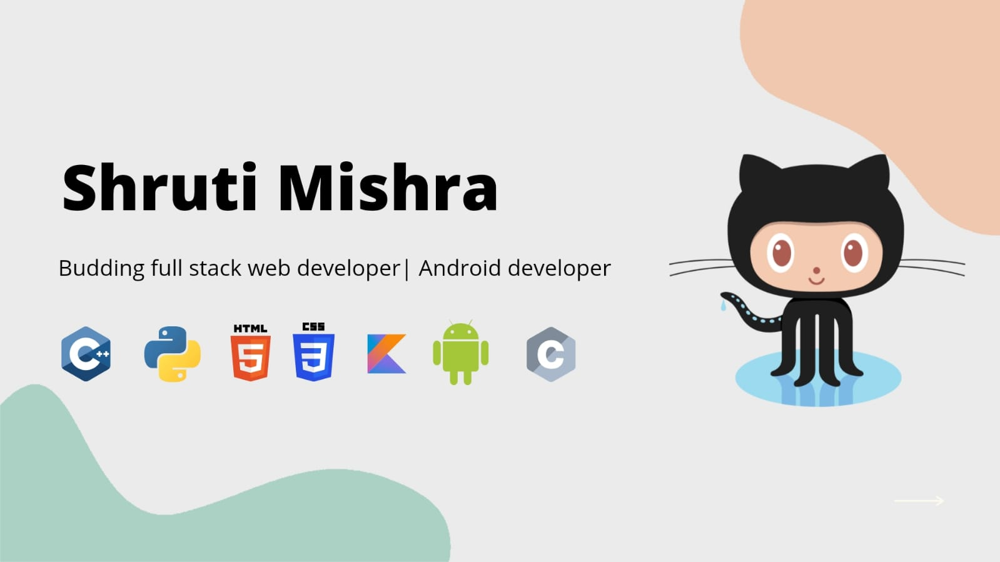

<!--### Hello Folks 👋-->
 
<h1 align="center">Hello, I'm Shruti Mishra </h1> 
 

<!---->

 
<h2 align="center"> Always striving to improve myself!</h2>

  

   
   ##  ABOUT ME 💁‍♀️: 

 <!--<h3 align="center">A GIRL WITH MANY DREAMS </h3>-->

<i> I'm A 2nd Year Artificial Intelligence & Data Science Undergraduate From Thakur College Of Engineering & Technology, Mumbai.
I'm A Tech Enthusiast,
Currently Exploring The Domains Of Web Development, Android Development, Python GUI And Open CV By Implementing Them To My Projects.
I Love Contributing To Open Source Community.

</i>

:octocat:  I am a part of CODING NINJAS AND CODXCRPTY COMMUNITY 
& also a [**CAMPUS AMBASSADOR**]:octocat:! 

👩‍💻 Former Android Developer Intern at letsgrowmore

:red_circle: :yellow_circle: :green_circle: :large_blue_circle: Graphic Core Committee Member at [**GOOGLE DEVELOPER STUDENT CLUB**]

⚡ Fun fact: You will always find me online on linkedin 😬.

✍🏻 I love 💝 to create artworks of all kind,  
My youtube channel: Shrutiomatic   

  
My instagram art page: Fantastic_Mandala   

  

 
:woman_student: My Portfolio :- https://shrutimishra-2002.github.io/Portfoliowebsite/

    
  
  
     

## 🛠 &nbsp;SKILLS:

- 💻LANGUAGES &nbsp;
  
  
  
  
  
  

- 🌐WEB BROWSERS &nbsp;
  
  
  
  
  
         

- 📔FRAMEWORK &nbsp;
  
  
 
 
- :books:DATABASE &nbsp;
 
 
 
 - :art:Design &nbsp;
 
 
 
 
 - :iphone:Development &nbsp;
 

- 👩‍💻IDE &nbsp; 

    

   

   

CONNECT WITH ME ON &nbsp;
  
  
  
  
  

 
 
   
  
:copyright: Shruti Mishra

  <!-- 
© 2021 Shruti Mishra 
 -->
